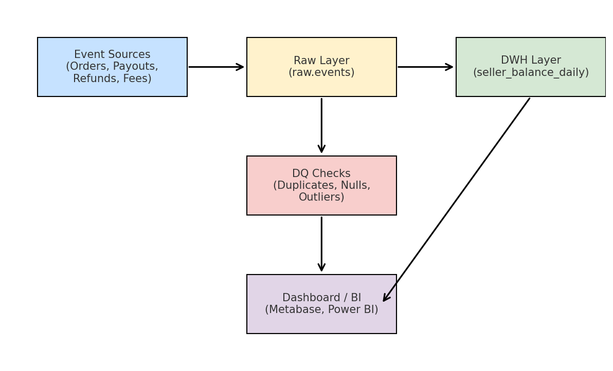

# Seller Balance PoC (ETL → DWH → DQ)

Мини-проект показывает, как собирать события по продавцам в единый финансовый баланс, строить дневные агрегаты и базовые DQ-проверки.

## Что внутри
- `data/events.csv` — синтетический датасет событий (orders/payouts/refunds/fees) на 14 дней для 10 продавцов.
- `sql/clickhouse_*.sql` — схемы и трансформации для ClickHouse.
- `sql/greenplum_*.sql` — схемы и трансформации для Greenplum/PostgreSQL.
- `airflow/dags/seller_balance_dag.py` — пример DAG для ежедневной загрузки и агрегации.
- `src/etl.py` — мини-скрипт валидации входных данных.

## Архитектура

Ниже — схема, показывающая, как данные проходят через пайплайн от исходных событий до аналитической витрины и BI-инструментов.



**Поток данных:**
1. **Event Sources** — исходные события (заказы, выплаты, возвраты, комиссии).
2. **Raw Layer (`raw.events`)** — загрузка необработанных данных в хранилище.
3. **DWH Layer (`seller_balance_daily`)** — дневные агрегаты по притоку/оттоку и расчёт баланса.
4. **DQ Checks** — базовые проверки качества данных: дубликаты, null-значения, аномалии по суммам.
5. **Dashboard / BI** — визуализация в Metabase, Power BI или другом инструменте.

Такой дизайн позволяет легко расширять пайплайн: добавлять новые источники, усложнять трансформации, внедрять near-real-time ingestion и интегрировать с ML feature store.

## Как протестировать быстро (без ClickHouse/Greenplum)
1. Открой `src/etl.py` и запусти:
   ```bash
   python src/etl.py
   ```
   Увидишь статистику и базовую валидацию.
2. Посмотри SQL-трансформации (ClickHouse/Greenplum) — они готовы к запуску в реальной среде.

## Как прогнать в ClickHouse (локально)
1. Подними ClickHouse (docker или локально).
2. Выполни:
   ```bash
   clickhouse-client --multiquery < sql/clickhouse_schema.sql
   cat data/events.csv | clickhouse-client --query="INSERT INTO raw.events FORMAT CSVWithNames"
   clickhouse-client --multiquery < sql/clickhouse_transforms.sql
   clickhouse-client --multiquery < sql/clickhouse_dq.sql
   ```

## Как прогнать в Greenplum/Postgres
1. Создай схемы и таблицы:
   ```bash
   psql -f sql/greenplum_schema.sql
   ```
2. Загрузись из CSV:
   ```bash
   \copy raw.events FROM 'data/events.csv' WITH (FORMAT csv, HEADER true);
   ```
3. Применяй трансформации и базовые DQ:
   ```bash
   psql -f sql/greenplum_transforms.sql
   psql -f sql/greenplum_dq.sql
   ```

## Airflow (скелет)
- Помести папку в `dags/` Airflow и убедись, что `clickhouse-client` доступен контейнеру.
- DAG: `seller_balance_daily` — шаги: загрузка raw → агрегации → DQ.

## Идеи для расширения
- Добавить feature store для ML (например, витрина последних N дней по продавцу).
- Подключить Kafka-стрим (producer → raw.events) и заменить batch на near-real-time ingestion.
- Добавить метрики в Prometheus/Grafana и алерты на DQ.
- Написать unit-тесты трансформаций (pytest) и CI/CD через GitHub Actions.

