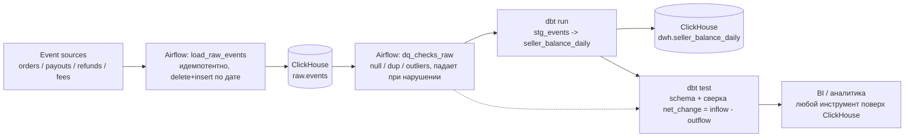

# Seller Balance Pipeline

ETL → dbt → DWH → DQ → Airflow: сквозной пайплайн пересчёта финансового баланса продавцов
маркетплейса на ClickHouse, с идемпотентной загрузкой, реальными проверками качества данных
и CI, который гоняет всё это на настоящем ClickHouse при каждом пуше.

Раньше это был скелет-PoC: DQ-проверка была функцией-заглушкой, которая просто печатала
"Run DQ checks..." и всегда возвращала успех, загрузка не была идемпотентной, тестов и CI не
было вовсе. Ниже — как это выглядит сейчас и почему сделано именно так (см. также
[docs/decisions.md](docs/decisions.md) — там подробно про trade-off'ы).

## Проблема
У маркетплейса есть события по продавцам: заказы, выплаты, возвраты, комиссии. Нужно ежедневно
пересчитывать баланс каждого продавца (сколько пришло, сколько ушло, накопительный итог) для
финансовой отчётности — быстро, идемпотентно (повторный запуск не должен всё сломать) и с
гарантией, что в витрину не попадут битые данные.

## Архитектура


```mermaid
flowchart LR
    A["Event sources\norders / payouts / refunds / fees"] --> B["Airflow: load_raw_events\nидемпотентно, delete+insert по дате"]
    B --> C[("ClickHouse\nraw.events")]
    C --> D["Airflow: dq_checks_raw\nnull / dup / outliers, падает при нарушении"]
    D --> E["dbt run\nstg_events -> seller_balance_daily"]
    E --> F[("ClickHouse\ndwh.seller_balance_daily")]
    D -.-> G["dbt test\nschema + сверка net_change = inflow - outflow"]
    E --> G
    G --> H["BI / аналитика\nлюбой инструмент поверх ClickHouse"]
```

## Технологический стек
Python · Airflow · dbt (dbt-clickhouse) · ClickHouse · Docker Compose · pytest · GitHub Actions

## Что внутри
```
data_generator/   параметризованный генератор синтетических событий (можно включить "грязные" строки)
pipeline/loader.py    общая логика идемпотентной загрузки в ClickHouse (переиспользуется DAG и CI)
dq/checks.py      реальные построчные DQ-проверки с порогами, поднимает исключение при нарушении
dbt/              staging + marts модели, schema-тесты, singular-тест на сверку баланса
airflow/dags/     DAG: load_raw_events -> dq_checks_raw -> dbt_run -> dbt_test
sql/              DDL raw-слоя; sql/legacy_greenplum — референсная версия под Postgres/Greenplum
tests/            pytest для DQ-модуля
.github/workflows/ci.yml   lint + unit-тесты + dbt run/test против настоящего ClickHouse
```

## Как запустить локально
Нужен только Docker.

```bash
make up          # поднимает ClickHouse + Airflow
make data         # генерирует свежие синтетические данные в data/events.csv
```

Дальше:
- Airflow UI: http://localhost:8080 (admin/admin) — запусти DAG `seller_balance_daily` вручную
  (Trigger DAG) или дождись расписания (`@daily`).
- ClickHouse: http://localhost:8123 — таблицы `raw.events` и `dwh.seller_balance_daily`.

Без Airflow, только пайплайн трансформаций:
```bash
python scripts/load_all.py --csv data/events.csv   # грузит всё разом (не по дате исполнения)
make dbt-run
make dbt-test
```

Проверить DQ-модуль отдельно (без Docker вообще):
```bash
make test         # pytest по dq/checks.py
make dq-run       # прогнать проверки на data/events.csv и увидеть отчёт в консоли
```

## Демонстрация: DQ действительно ловит битые данные
Генератор умеет намеренно портить часть строк (`--dirty-fraction`), чтобы было на чём проверять DQ:

```bash
python data_generator/generate_events.py --sellers 10 --days 14 --seed 42 \
    --dirty-fraction 0.02 --out data/events_dirty.csv
PYTHONPATH=. python dq/checks.py data/events_dirty.csv
```

На прогоне с `--dirty-fraction 0.02` (683 строки) отчёт реально находит внесённые проблемы:

```
DQ report: 683 rows checked
  [FAIL (error)] required_fields_not_null: 3 строк с null/пустыми значениями
  [FAIL (error)] unique_event_id: 10 строк с повторяющимся event_id
  [FAIL (error)] amount_within_range: 5 строк с amount вне диапазона
  [OK] categorical_domains: 0 строк с неожиданным event_type/direction
  [FAIL (error)] error_row_rate: доля строк с ошибками 2.64% (порог 2%)
```
На чистом датасете (`--dirty-fraction 0`, по умолчанию) все проверки проходят.

## CI
На каждый push/PR (`.github/workflows/ci.yml`):
1. `ruff check` + `pytest` для DQ-модуля;
2. поднимается настоящий ClickHouse (service container), генерируются данные, применяется DDL,
   гоняются `dbt run` и `dbt test`;
3. синтаксическая проверка DAG-файла.

## Ограничения и что дальше
См. [docs/decisions.md](docs/decisions.md) — там расписано, что изменилось бы при росте нагрузки
(near-real-time приём через Kafka/CDC, incremental-пересчёт баланса с opening balance, реальный
алертинг вместо лог-стаба, метрики DQ в Prometheus/Grafana).
